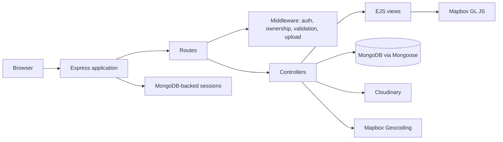

# # Homigo — Airbnb-Style Rental Listing Platform

A server-rendered, Airbnb-style rental listing platform built with Node.js, Express, EJS, and MongoDB.

## Overview

Homigo is a portfolio supporting project focused on full-stack web application fundamentals. Users can browse listings, create an account, manage their own listings, upload listing photos, leave reviews, and view a listing location on a map.

It is a traditional server-rendered application: Express handles routes and controllers, EJS renders the UI, and MongoDB stores application data. This repository does not use React.

## Features

- Browse a catalogue of rental listings and open individual listing pages.
- Sign up, log in, and log out with Passport local authentication.
- Create, update, and delete listings when signed in.
- Restrict listing edits and deletion to the listing owner.
- Upload PNG or JPEG listing images to Cloudinary through Multer.
- Convert listing locations to GeoJSON points with Mapbox geocoding.
- Show a Mapbox map and marker on listing detail pages.
- Add reviews with a 1–5 rating and comment when signed in.
- Restrict review deletion to its author.
- Validate listing and review payloads with Joi, with client-side Bootstrap form feedback.
- Persist sessions in MongoDB and display flash messages after actions.

## Tech Stack

- **Runtime:** Node.js (the project declares Node `24.13.0`)
- **Server:** Express 5
- **Views:** EJS with ejs-mate layouts; Bootstrap, Font Awesome, and custom CSS
- **Database / ODM:** MongoDB with Mongoose
- **Authentication:** Passport, passport-local, and passport-local-mongoose
- **Sessions:** express-session, connect-mongo, and connect-flash
- **Validation:** Joi
- **Media:** Multer, multer-storage-cloudinary, and Cloudinary
- **Location:** Mapbox Geocoding SDK and Mapbox GL JS

## Architecture



## Data Models

### Listing

| Field | Stored value |
| --- | --- |
| `title` | Required string |
| `description`, `price`, `location`, `country` | Listing details |
| `image` | Cloudinary `url` and `filename` (with defaults in the schema) |
| `owner` | Reference to `User` |
| `reviews` | Array of references to `Review` |
| `geometry` | Required GeoJSON `Point` with `[longitude, latitude]` coordinates |

Deleting a listing through `findOneAndDelete` also deletes the reviews referenced by that listing.

### Review

| Field | Stored value |
| --- | --- |
| `comment` | String |
| `rating` | Number from 1 to 5 |
| `createdAt` | Date, defaulting to creation time |
| `author` | Reference to `User` |

### User

| Field | Stored value |
| --- | --- |
| `email` | Required string |
| `username`, password hash and salt | Added and managed by `passport-local-mongoose` |

## Authentication and Authorization

Passport Local handles registration and username/password sign-in. Passport serializes users into an Express session, and `connect-mongo` stores those sessions in MongoDB.

Protected actions redirect unauthenticated users to `/login` and preserve the originally requested URL. Listing update/delete actions check the listing owner; review deletion checks the review author. The app uses `Joi` to validate listing and review request bodies before the controllers run.

## Project Structure

```text
Homigo/
├── app.js                 # Express app, MongoDB connection, sessions, Passport
├── controllers/           # Listing, review, and user actions
├── routes/                # Express route definitions
├── models/                # Mongoose Listing, Review, and User schemas
├── views/                 # EJS pages, layout, and shared partials
├── public/                # CSS and browser-side JavaScript
├── middleware.js          # Auth, authorization, and Joi validation middleware
├── cloudConfig.js         # Cloudinary / Multer storage configuration
├── schema.js              # Joi request schemas
└── init/                  # Sample listing data and seeding script
```

## Local Setup

### Prerequisites

- Node.js `24.13.0` (as declared in `package.json`)
- A local MongoDB instance available at `mongodb://127.0.0.1:27017`
- Cloudinary and Mapbox credentials

### Install and run

```bash
npm install
node app.js
```

The application listens on `http://localhost:3000`.

`package.json` currently has no `start` script; `node app.js` is the repository's direct run command. The only defined npm script is `npm test`, which intentionally exits with “no test specified.”

## Environment Variables

Create a `.env` file in the project root. These are the variables present in the repository:

```env
SECRET=replace-with-a-session-secret
CLOUD_NAME=your-cloudinary-cloud-name
CLOUD_API_KEY=your-cloudinary-api-key
CLOUD_API_SECRET=your-cloudinary-api-secret
MAP_TOKEN=your-mapbox-access-token
MONGODB_URL=mongodb://127.0.0.1:27017/homigo
```

`SECRET`, the Cloudinary variables, and `MAP_TOKEN` are used by the application. `MONGODB_URL` is present in the environment file and referenced in comments, but `app.js` and the seed script currently connect to the hard-coded local database URL shown above. Change those files if you need a different MongoDB connection string.

## Seed Data

The repository includes sample listings in `init/data.js` and a seed script at `init/index.js`.

```bash
node init/index.js
```

The seed script deletes all `Listing` documents, geocodes each sample location with Mapbox, and inserts the resulting listings. It does not seed users or reviews, and it assigns listings to a fixed user ObjectId. Ensure a compatible user exists before relying on owner information in the listing UI.

## What This Project Demonstrates

- Server-rendered MVC organization with Express, controllers, routes, and EJS views.
- MongoDB data modeling and document relationships using Mongoose references.
- Session-based authentication, protected routes, and ownership authorization.
- CRUD workflows, request validation, file uploads, third-party service integration, and error/flash-message handling.

## Author

**M Chakradar Reddy**  
Project repository: [Homigo](.)
